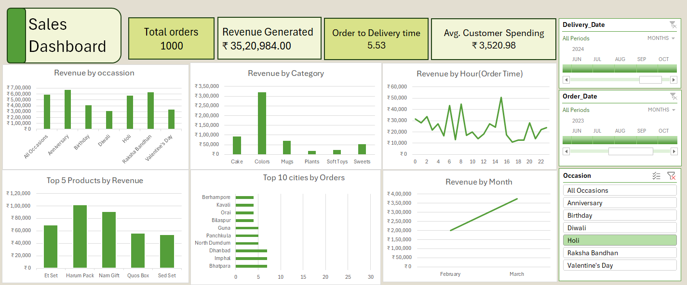

# Excel Sales Dashboard Project

## Overview
This project showcases an interactive Excel dashboard built using pivot tables, charts, and slicers to analyze sales data.

## Dashboard Preview

## Features
- Dynamic Pivot Tables
- KPI Metrics (Total Sales, Profit, Orders)
- Interactive Slicers for filtering
- Data Visualization using Charts

## Tools Used
- Microsoft Excel
- Data Cleaning
- Pivot Tables
- Data Visualization

## Purpose

To demonstrate data analysis and dashboard creation skills using Excel for business insights.
